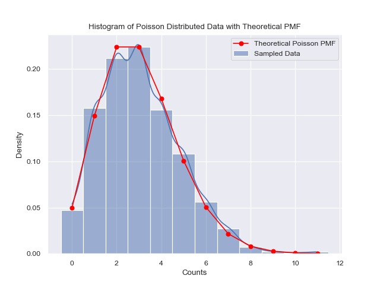

# Poisson Distribution Simulation

## Author

Chuncheng Zhang

## Date

2025-02-07

## Purpose

This Streamlit app simulates the Poisson distribution. It allows users to visualize the histogram of sampled data and compare it with the theoretical Poisson distribution.

### Poisson Distribution Equation

The Poisson distribution is given by the equation:
\[ P(X = k) = \frac{\lambda^k e^{-\lambda}}{k!} \]
where \( \lambda \) is the average rate of occurrence, and \( k \) is the number of occurrences.

### Simulation

The script simulates the Poisson distribution by generating time gaps between events using an exponential distribution with parameter \( \lambda \). These gaps are then accumulated to simulate the occurrence of events over time.

## Requirements

- Python 3.x
- numpy
- pandas
- seaborn
- matplotlib
- tqdm
- rich
- scipy
- streamlit

## Installation

To install the required packages, run:

```bash
pip install numpy pandas seaborn matplotlib tqdm rich scipy streamlit
```

## Usage

To run the Streamlit app, use the following command:

```bash
streamlit run /path/to/poisson-distribution.py
```

Replace `/path/to/poisson-distribution.py` with the actual path to the script.

## Features

- Generate time gaps based on a Poisson process.
- Create a DataFrame of event onsets.
- Sample data from the generated onsets.
- Visualize the histogram of sampled data.
- Compare the histogram with the theoretical Poisson distribution.

## How to Use

1. Run the Streamlit app.
2. Use the slider to select the lambda value.
3. The app will display the histogram of sampled data and the theoretical Poisson distribution.

## Example



## License

This project is licensed under the terms of the MIT license.
