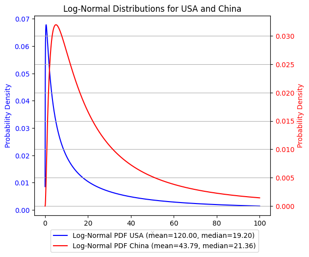
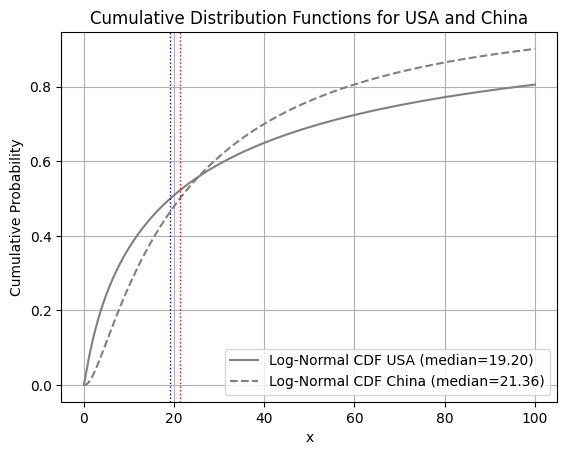

# 与AI合作：Skewed Distribution Demo

本文记述与AI合作时遇到的小问题，那就是不了解数学原理的AI盲目调用API引起失效。
本次合作要完成的工作是源于一条新闻，那就是美国大使馆发布了一则新闻，说美国家庭平均净资产价值120万美元，而中位数仅为9.6万美元。
于是从统计学的角度上说，有了这两个数值，如果假定户均财富服从`lognorm`分布，那么整个国家的财富分布是可以估计出来的。这就是简单的点估计问题。

工作过程是这样的，AI帮我搭建了框架，但在检查代码时发现它遇到了自己解决不了的困难，我觉得这个困难与一开始的点估计问题相比似乎更有意思，所以本文是同时记录这两件事情。

中文部分是我写的，英文部分是AI在我改完的代码的基础上写的。我觉得AI写得比我好。

---

[toc]

## 论AI工具之不好用

首先，我最近频繁使用AI工具进行辅助变成，堪称事半功倍。但AI也有不好用的时候。
它不好用的场景很多，本文是其中比较典型的一种失效场景，我称为

> 不了解数学原理的AI盲目调用API引起失效。

具体来说，我想要是这样一个分布
[lognorm](https://en.wikipedia.org/wiki/Log-normal_distribution "lognorm")，
它是一种由正态分布衍生的偏态的（skewed）分布。

$$
pdf = \frac{1}{\sigma x \sqrt{2\pi}} \cdot \exp\left(-\frac{(\log(x) - \mu)^2}{2 \sigma^2}\right)
$$

从概率密度函数可见，它在指数项与分母项中含有随机变量$X$，但偏移项$\mu$只存在于分母项中。
而`scipy`工具中提供的对应API不支持这种$\mu$参数，而是仅能通过`loc`变量进行整体偏移。

[scipy-lognorm-doc](https://docs.scipy.org/doc/scipy-1.15.0/reference/generated/scipy.stats.lognorm.html "scipy-lognorm-doc")


因此在我希望AI生成合适的`lognorm`概率密度曲线时，它遇到了困难，几乎无法完成我想要的工作。
于是我不得不重写这个方法（见[code](#code)部分）。

```python
def lognormal_pdf(x, mean, median):
    '''
    Compute the PDF of a log-normal distribution given the mean and median.
    :param x: The x values to compute the PDF for.
    :param mean: The mean of the log-normal distribution.
    :param median: The median of the log-normal distribution.
    '''
    pass
```

在此方法写成之后，AI能够正确地使用它完成以下工作。
经过`cmf`函数的验证后，我觉得我写的代码和AI的使用逻辑都是正确的。
下面的分析得到的主要结论是虽然中美两国的户均净资产差距较大，但中位数的约对值是差不多的，这导致美国的贫富差距问题比中国要严重得多。

This document demonstrates the comparison of log-normal distributions for the USA and China. The log-normal distribution is characterized by its mean and median values.

## Log-Normal Distribution

The probability density function (PDF) of a log-normal distribution is given by:

$$
pdf = \frac{1}{\sigma x \sqrt{2\pi}} \cdot \exp\left(-\frac{(\log(x) - \mu)^2}{2 \sigma^2}\right)
$$

where:

- \( \mu \) is the mean of the logarithm of the variable.
- \( \sigma \) is the standard deviation of the logarithm of the variable.

The mean and median of the log-normal distribution are related to \( \mu \) and \( \sigma \) as follows:

$$
mean = \exp(\mu + \sigma^2 / 2)
$$

$$
median = \exp(\mu)
$$

## Comparison of USA and China

We compare the log-normal distributions for the USA and China using the following parameters:

- **USA**:
  - Mean: 120
  - Median: 19.2

- **China**:
  - Mean: 289 (adjusted by exchange rate)
  - Median: 141 (adjusted by exchange rate)

### Probability Density Functions

The following plot shows the probability density functions (PDFs) for the USA and China:



### Cumulative Distribution Functions

The following plot shows the cumulative distribution functions (CDFs) for the USA and China:



### Code

The code used to generate these plots is as follows:

```python
# The lognormal pdf and cdf function
import numpy as np
import matplotlib.pyplot as plt

def lognormal_pdf(x, mean, median):
    '''
    Compute the PDF of a log-normal distribution given the mean and median.

    $$mean = \exp(\mu + \sigma^2/2)$$

    $$median = \exp(\mu)$$

    $$pdf = \frac{1}{\sigma * x * \sqrt(2*\pi)} * exp(-\frac{(log(x) - mu)^2} { 2 \sigma^2}$$

    :param x: The x values to compute the PDF for.
    :param mean: The mean of the log-normal distribution.
    :param median: The median of the log-normal distribution.
    '''
    mu = np.log(median)
    mu_s2_2 = np.log(mean)
    s = np.sqrt((mu_s2_2 - mu) * 2)
    return 1/s/np.sqrt(2*np.pi)/x * np.exp(-((np.log(x) - mu) ** 2) / 2 / s ** 2)

def compute_cdf(pdf, x):
    """Compute the CDF from the PDF."""
    return np.cumsum(pdf) * np.diff(np.insert(x, 0, 0))

# Example usage
if __name__ == "__main__":
    # Log-Normal distribution for USA with mean 120 and median 19.2
    median1 = 19.2
    mean1 = 120
    x = np.linspace(0.01, 100, 1000)
    pdf_values1 = lognormal_pdf(x, mean1, median1)
    cdf_values1 = compute_cdf(pdf_values1, x)

    # Log-Normal distribution for China with mean 289 and median 141
    exchange_rate = 1 / 6.6
    median2 = 141 * exchange_rate
    mean2 = 289 * exchange_rate
    pdf_values2 = lognormal_pdf(x, mean2, median2)
    cdf_values2 = compute_cdf(pdf_values2, x)

    fig, ax1 = plt.subplots()

    # Plot the Log-Normal distribution for USA
    line1, = ax1.plot(x, pdf_values1, label=f'Log-Normal PDF USA (mean={mean1:.2f}, median={median1:.2f})', color='b')
    ax1.set_xlabel('x')
    ax1.set_ylabel('Probability Density', color='b')
    ax1.tick_params(axis='y', labelcolor='b')

    # Create a second y-axis for the second distribution
    ax2 = ax1.twinx()
    line2, = ax2.plot(x, pdf_values2, label=f'Log-Normal PDF China (mean={mean2:.2f}, median={median2:.2f})', color='r')
    ax2.set_ylabel('Probability Density', color='r')
    ax2.tick_params(axis='y', labelcolor='r')

    fig.tight_layout()
    plt.title('Log-Normal Distributions for USA and China')
    plt.grid(True)
    fig.legend(handles=[line1, line2], loc='lower center', bbox_to_anchor=(0.5, -0.05), ncol=1)
    plt.show()

    # Plot the CDFs
    plt.plot(x, cdf_values1, label=f'Log-Normal CDF USA (median={median1:.2f})', color='gray')
    plt.plot(x, cdf_values2, label=f'Log-Normal CDF China (median={median2:.2f})', color='gray', linestyle='dashed')
    plt.axvline(median1, color='b', linestyle='dotted', linewidth=1)
    plt.axvline(median2, color='r', linestyle='dotted', linewidth=1)
    plt.xlabel('x')
    plt.ylabel('Cumulative Probability')
    plt.title('Cumulative Distribution Functions for USA and China')
    plt.legend(loc='lower right')
    plt.grid(True)
    plt.show()

# %%
