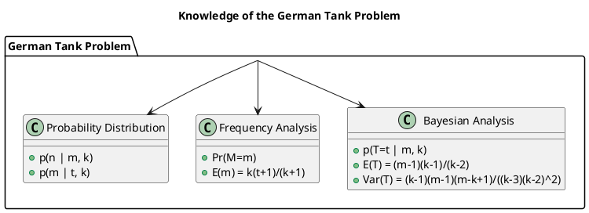

# Summary of Graphs

This document contains the summary and placeholders for the graphs referenced in the binomial distribution documents.

## Prompts

1. Draw the plantuml graph for the knowledge of the german tank problem.
2. Place the expectation and variance formula into the plantuml, and add necessary explaining.

## PlantUML Diagram for German Tank Problem

### Explanation

- **Bayesian Analysis**: This section includes the posterior probability \( p(T=t | m, k) \), the expectation \( E(T) \), and the variance \( Var(T) \).
- **Frequency Analysis**: This section includes the probability \( Pr(M=m) \) and the expectation \( E(m) \).
- **Probability Distribution**: This section includes the probability distributions \( p(n | m, k) \) and \( p(m | t, k) \).

## Graphs

### doc-1.md

### doc-2.md

### doc-3.md

### doc-4.md

### doc-5.md

### doc-6.md

